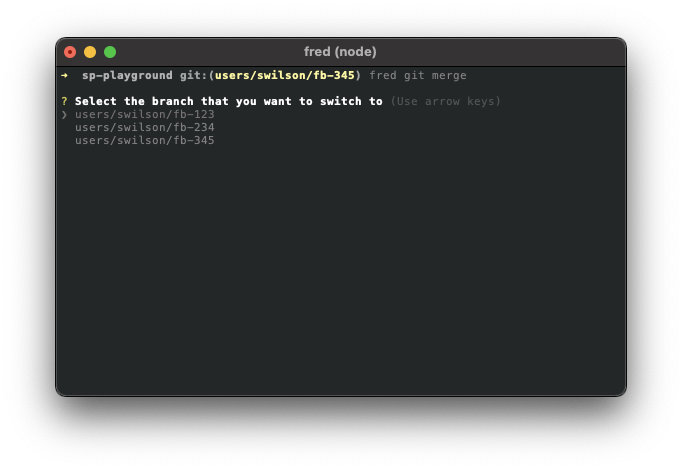
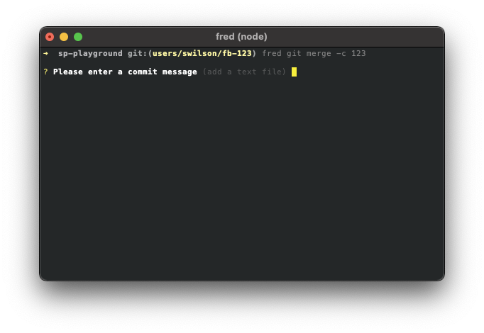

## Merge

The merge command reduces a bunch of common GIT commands into a single command.  

### Usage

```
Options:
      --version     Show version number                                [boolean]
  -h, --help        Show help                                          [boolean]
  -v, --verbose     Run with verbose logging                           [boolean]
  -c, --casenumber  Case number                                         [number]
  -m, --message     Commit Message                                      [string]
  -k, --keep        Keeps local and remote branches after merge      [boolean]
```

### Example

```sh
fred git merge -c 1234 -m "My First Commit Message"
```

### Addition info

This merge command runs the following:

1. `git switch master`
2. `git pull`
3. `git switch ${branchName}`
4. `git merge master -m "BugzId: ${casenumber} - merging master to branch"`
5. `git switch master`
6. `git merge --squash ${branchName}`
7. `git commit -m "BugzId: ${casenumber} - ${commitMessage}"`
8. `git push`

If you do not provide the -c option followed by a case number, you will be provided a list of branches to select from.



If you do not provide the -m option followed by a message, you will be prompted for one.

A nice feature is that the prompt for a message will be populated with the last message used on the merged branch.  You can hit enter to use it or type a new message.



[Back](../README.md) to fred git documentation.